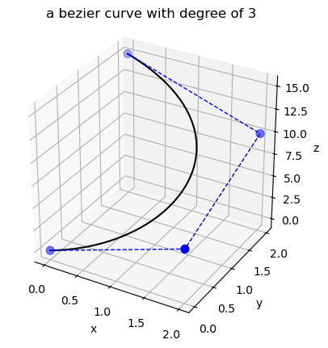

# Examples: more details please see demo.py

## sample1: create a bezier curve
import BezierKit

ctrlpts = ([0, 2, 15], [2, 2, 10], [2, 0, 5], [0, 0, 0])

bezier = BezierKit.CreateBezier(ctrlpts)

## sample2: plot a bezier
bezier.Plot()

## sample3: evaluate the curve at single u
u = 0.1

pt = bezier.Evaluated(u)

## sample4: calculate the trace of the bezier
trace = bezier.Trace()

## sample5: calculate the order-th derivative of a bezier curve
order = 2

der = bezier.Derivative(u, order)

